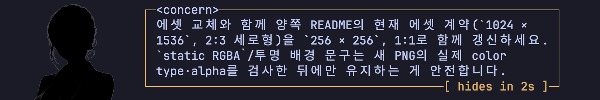

<p align="center">
  
</p>

<p align="center">
  <strong>A bounded in-process Advisor companion widget for OMP.</strong>
</p>

<p align="center">
  <a href="https://github.com/can1357/oh-my-pi"></a>
  <a href="https://bun.sh"></a>
  <a href="https://www.typescriptlang.org"></a>
</p>

<p align="center">
  Built for <a href="https://github.com/can1357/oh-my-pi">Oh My Pi</a>'s existing Advisor runtime.
</p>

<p align="center">
  <a href="#english">English</a> · <a href="README.ko.md">한국어</a>
</p>

<a id="english"></a>

`omp-advisor-companion` displays a static character image and the latest Advisor note in an OMP widget above the editor. The widget appears only when an Advisor message arrives. On wider hosts, the image sits beside the bubble; on narrower hosts, it stacks above the bubble. The widget is non-modal, never takes focus, and hides OMP's built-in Advisor transcript card so each note appears only once.

It does not run a separate reviewer model. Instead, it observes OMP's built-in Advisor messages and updates a single widget under the stable `omp-advisor-companion` key.

The bubble header contains only the severity tag, such as `<concern>`.

<p align="center">
  
</p>

## Requirements

- [OMP](https://github.com/can1357/oh-my-pi) 18 or newer
- A configured OMP Advisor model
- [Bun](https://bun.sh) 1.3.14 or newer on `PATH` for OMP plugin package management

The plugin itself runs inside the host OMP process and does not require a separate Bun runtime after installation. However, OMP 18.0.7's plugin manager launches the external `bun` executable for Git/npm plugin installation, reinstallation, and uninstallation. Users who installed OMP with Bun already satisfy this requirement; users of a prebuilt OMP binary, Homebrew, or Nix must install Bun separately before running the plugin-management commands in this README.

Kitty graphics support is optional. Without it, OMP's `Image` component provides a text fallback instead of rendering the image.

## Install

Install directly from the GitHub repository:

```sh
omp plugin install github:azyu/omp-advisor-companion
```

The full Git URL is equivalent:

```sh
omp plugin install https://github.com/azyu/omp-advisor-companion
```

Restart OMP after installation. In OMP 18 or newer, `/reload-plugins` refreshes plugin-owned skills, commands, agents, and MCP state, but does not re-import extension factories in the running process.

Confirm the installed plugin:

```sh
omp plugin list
```

## Configure Advisor

The plugin reuses OMP Advisor and does not configure the Advisor model itself. A minimal `~/.omp/agent/config.yml` configuration looks like:

```yaml
modelRoles:
  advisor: gpt-5.6-sol

advisor:
  enabled: true
```

Use any Advisor-capable model available in your OMP installation. See OMP's [Advisor documentation](https://github.com/can1357/oh-my-pi/blob/main/docs/advisor-watchdog.md) for model roles, `WATCHDOG.md`, and multi-advisor rosters.

## Usage

Start OMP, then use the built-in commands:

```text
/advisor on
/advisor status
/advisor off
```

Behavior:

- `/advisor on` enables mirroring but keeps the widget hidden until a valid Advisor message arrives. Repeated activation is idempotent.
- When Kitty output is used, the self-contained image block remains contiguous and byte-for-byte unchanged before the bubble; no alignment spaces are added.
- A valid Advisor message creates or replaces the image-and-bubble group with the latest valid note unless mirroring was explicitly turned off.
- Each successfully displayed note stays visible for `displayDurationSeconds` seconds (default `30`). The bubble's bottom border shows `[ hides in Ns ]` aligned toward its lower-right edge and updates once per second. When the countdown reaches `1s`, the widget hides. A newer note replaces the current widget and resets both the hide timer and countdown. A value of `0` disables automatic hiding and removes the countdown.
- `/advisor off` removes the widget, discards the current note, and leaves later Advisor messages to the host until mirroring is enabled again.
- Session start, session switching, and session shutdown clear the widget and reset the mirrored state.
- The bare `/advisor` command toggles only after the extension knows the state. An unknown state remains hidden until a real Advisor note arrives.
- Non-TUI and no-UI OMP modes are silent no-ops.

The image is loaded lazily when a valid Advisor message needs to be displayed. Each resolved local image path has its own retryable Promise cache: successful loads are reused, while failed loads are removed so a corrected file can be loaded later. An invalid configured override produces one warning for that activation and falls back to the bundled asset; if the bundled asset also fails, the widget remains hidden.

## FAQ

### Why is the image missing when OMP runs in Herdr inside Ghostty?

Terminal capability detection may not identify the outer Ghostty session through Herdr. Force Kitty graphics and Kitty Unicode placeholders only in Herdr-managed shells by adding the following to `~/.zshrc`:

```sh
if [[ "${HERDR_ENV:-}" == "1" ]]; then
  export PI_FORCE_IMAGE_PROTOCOL=kitty
  export PI_KITTY_PLACEHOLDERS=1
fi
```

`PI_FORCE_IMAGE_PROTOCOL=kitty` selects the Kitty image protocol. `PI_KITTY_PLACEHOLDERS=1` explicitly enables the Unicode placeholders needed to position images through the multiplexer. Open a new Herdr pane, or reload the shell configuration, and then restart OMP so it inherits both variables. Do not set these variables globally unless every terminal in which OMP runs supports Kitty graphics.

## Resource settings

The bundled default is `assets/advisor.png`, a neutral placeholder character image. Global settings use OMP's plugin configuration commands:

```sh
omp plugin config set omp-advisor-companion imagePath /absolute/path.png
omp plugin config set omp-advisor-companion imageMaxWidth 20
omp plugin config set omp-advisor-companion imageMaxHeight 14
omp plugin config set omp-advisor-companion bubbleMaxWidth 60
omp plugin config set omp-advisor-companion displayDurationSeconds 30
omp plugin config list omp-advisor-companion
```

`imagePath` accepts an absolute local PNG path or a path relative to the active project's OMP `context.cwd`. A leading `~/` is expanded to the user's home directory. URLs, data URIs, globs, and OMP internal URI schemes are not interpreted as image paths.

Project-specific settings go in `.omp/plugin-overrides.json` and override the corresponding global values:

```json
{
  "settings": {
    "omp-advisor-companion": {
      "imagePath": "./assets/project-advisor.png",
      "imageMaxWidth": 24,
      "imageMaxHeight": 18,
      "bubbleMaxWidth": 72,
      "displayDurationSeconds": 15
    }
  }
}
```

The effective settings precedence is:

1. A non-empty project or global `imagePath` value from the merged OMP plugin settings;
2. `OMP_ADVISOR_COMPANION_IMAGE` when `imagePath` is empty;
3. The bundled `assets/advisor.png` placeholder.

Numeric settings are normalized to finite integers and clamped to their manifest ranges: image width `8`–`40` cells (default `20`), image height `6`–`30` cells (default `14`), bubble width `20`–`120` visible columns when configured, and display duration `0`–`3600` seconds (default `30`). When `bubbleMaxWidth` is omitted, the bubble uses the available render width. A display duration of `0` disables automatic hiding and the widget countdown. The countdown disappears when the widget hides, `/advisor off` runs, or the session is cleaned up. Changes apply after `/advisor off` followed by `/advisor on`; restarting OMP also applies them.

## Widget bounds and image ratios

The widget uses `ctx.ui.setWidget("omp-advisor-companion", factory, { placement: "aboveEditor" })` and OMP's `@oh-my-pi/pi-tui` `Image` component. In OMP 18 or newer, `WidgetPlacement` provides only `aboveEditor` and `belowEditor`: this is an above-editor widget, not a true right-hand dock, and it does not reserve editor width. The extension does not use a custom overlay because the widget must remain non-modal and never take focus.

- The widget is absent until a valid Advisor note is available.
- With enough host width, the image and bubble render side by side; narrower hosts stack the image above the bubble.
- When Kitty output is used, the self-contained image block remains contiguous and byte-for-byte unchanged before the bubble; no alignment spaces are added.
- Bubble: contained within the configured visible-column cap when set, or the available render width when omitted or narrower.
- OMP `Image` preserves the source pixel aspect ratio while fitting it inside the configured cell bounds. No special case is needed for 1:1, 2:3, 3:4, landscape, or other PNG ratios.
- `imageMaxWidth` and `imageMaxHeight` are upper bounds, not forced output dimensions. The schema's `min` values only validate configuration; they do not impose a minimum rendered size.
- Omitting the settings applies the defaults (`20×14` cells). OMP may render fewer cells when the source aspect ratio or host width requires it—for example, a 1:1 PNG typically uses fewer rows than a 2:3 PNG.
- Removing both caps would let OMP fit the image to available width, but the widget renderer is not given a reliable terminal-height budget. The plugin therefore keeps explicit caps to prevent the image from consuming excessive vertical space.
- Transparent canvas margins count toward the source aspect ratio. Trim transparent margins when the visible character should fill more of the configured bounds.

## Character asset

The default character is:

```text
assets/advisor.png
```

Asset contract:

- static RGBA PNG
- `256 × 256`, 1:1 square
- transparent background
- no embedded text or speech bubble
- 2 MiB or smaller recommended

Replace the file only with an image you have the right to distribute. The extension validates the PNG signature before encoding it for OMP's image component.

## Development

```sh
bun install
bun run check
bun test
bun run build
```

To work from a local checkout:

```sh
git clone https://github.com/azyu/omp-advisor-companion
cd omp-advisor-companion
bun install
omp plugin link .
```

`omp plugin link .` creates a user-global development symlink. Source changes require an OMP restart.

For project-only development, add the checkout path to the consuming project's `.omp/settings.json` instead of linking it globally:

```json
{
  "extensions": [
    "/absolute/path/to/omp-advisor-companion"
  ]
}
```

Merge this entry into an existing settings file rather than replacing unrelated settings.

The focused test suite covers:

- exact Advisor command parsing;
- valid and malformed Advisor custom-message extraction;
- controller activation, replacement, clearing, stale-image suppression, and non-TUI behavior;
- speech-bubble sanitization, wrapping, severity labels, configurable caps, and width limits.

Project layout:

```text
src/
├── index.ts           # OMP extension, settings, state, and widget lifecycle
├── advisor-events.ts  # Advisor commands, note types, and message parsing
└── panel-view.ts      # Bounded image and speech-bubble component
```

## Upgrade

```sh
omp plugin upgrade omp-advisor-companion
```

Restart OMP after upgrading.

## Uninstall

```sh
omp plugin uninstall omp-advisor-companion
```

## Disclaimer

- The bundled placeholder image (`assets/advisor.png`) was generated with AI.

## Acknowledgements

- [Oh My Pi](https://github.com/can1357/oh-my-pi) provides the extension API, the Advisor runtime, and the terminal image renderer.
